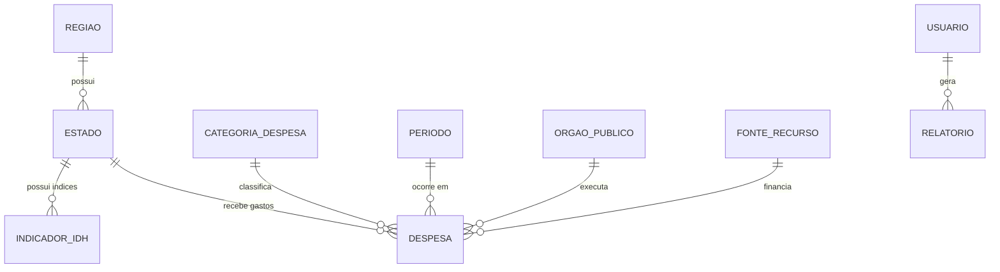

# 📊 FASE 1 COMPLETA: MODELAGEM DE DADOS - DEC7588

## 🎯 **OBJETIVOS ALCANÇADOS**

✅ **Modelo Conceitual** com **12+ entidades**  
✅ **Modelo Lógico** implementado com SQLAlchemy  
✅ **Scripts DDL** completos para PostgreSQL  
✅ **Sistema de conexão** robusto e escalável  
✅ **Configurações** centralizadas e ambientais  

---

## 🏗️ **ARQUITETURA DO SISTEMA**

### **Tecnologias Utilizadas**
- **SGBD**: PostgreSQL 13+
- **ORM**: SQLAlchemy 2.0+  
- **Linguagem**: Python 3.10+
- **Drivers**: psycopg2-binary
- **Ambiente**: Multiplataforma (Windows, Linux, macOS)

### **Estrutura de Diretórios**
```
src/
├── database/
│   ├── __init__.py           # Módulo de banco
│   ├── connection.py         # Gerenciador de conexões
│   ├── config.py            # Configurações centralizadas
│   └── schema.sql           # Scripts DDL PostgreSQL
├── models/
│   ├── __init__.py          # Módulo de modelos
│   └── entities.py          # 12 entidades SQLAlchemy
├── crud/                    # [Fase 2] Operações CRUD
├── queries/                 # [Fase 3] Consultas especializadas
├── interface/               # [Fase 4] Interface do usuário
└── llm/                     # [Fase 4] Integração IA
    ├── __init__.py
    └── llm_handler.py       # ✅ Já implementado
```

---

## 🗄️ **MODELO DE DADOS**

### **12 ENTIDADES IMPLEMENTADAS**

#### **🌍 ENTIDADES GEOGRÁFICAS**
1. **Regiao** - Regiões geográficas do Brasil (5 regiões)
2. **Estado** - Estados e Distrito Federal (27 UFs)  
3. **Municipio** - Municípios por estado (expansão futura)

#### **🏛️ ENTIDADES ORGANIZACIONAIS**
4. **OrgaoPublico** - Órgãos responsáveis pelos gastos
5. **FonteRecurso** - Fontes de recursos financeiros

#### **💰 ENTIDADES FINANCEIRAS**
6. **CategoriaDespesa** - Tipos de despesas (Saúde, Educação, etc.)
7. **Periodo** - Períodos temporais (2019-2023)
8. **Orcamento** - Orçamentos previstos vs executados
9. **Despesa** - **ENTIDADE CENTRAL** - Despesas realizadas

#### **📈 ENTIDADES DE INDICADORES**
10. **IndicadorIDH** - Índices de desenvolvimento humano

#### **👥 ENTIDADES DO SISTEMA**
11. **Usuario** - Usuários com diferentes níveis de acesso
12. **Relatorio** - Relatórios gerados pelo sistema

---

## 🔗 **RELACIONAMENTOS PRINCIPAIS**



### **Cardinalidades**
- **Estado** N:1 **Regiao**
- **Despesa** N:1 **Estado, CategoriaDespesa, Periodo, OrgaoPublico, FonteRecurso**
- **IndicadorIDH** N:1 **Estado, Periodo**
- **Relatorio** N:1 **Usuario**

---

## 🔧 **CARACTERÍSTICAS TÉCNICAS**

### **Normalização**
- ✅ **3ª Forma Normal (3NF)**
- ✅ **Integridade referencial** garantida
- ✅ **Constraints de domínio** implementadas
- ✅ **Índices otimizados** para performance

### **Auditoria e Controle**
- ✅ Campos `created_at` em todas as entidades
- ✅ Campos `updated_at` onde necessário
- ✅ Campos de controle (`ativo`, `status`)
- ✅ Triggers para auditoria automática

### **Segurança**
- ✅ **Foreign Key Constraints** com CASCADE
- ✅ **Check Constraints** para validação
- ✅ **Unique Constraints** para evitar duplicatas
- ✅ **Índices compostos** para consultas complexas

---

## 📋 **SCRIPTS E ARQUIVOS CRIADOS**

### **Modelos SQLAlchemy**
- **`src/models/entities.py`** - 12 entidades completas (350+ linhas)
- **`src/models/__init__.py`** - Configuração do módulo

### **Sistema de Conexão**
- **`src/database/connection.py`** - Gerenciador robusto PostgreSQL (300+ linhas)
- **`src/database/config.py`** - Configurações centralizadas
- **`src/database/__init__.py`** - Configuração do módulo

### **Scripts SQL**
- **`src/database/schema.sql`** - DDL completo PostgreSQL (200+ linhas)

### **Sistema Principal**
- **`main.py`** - Ponto de entrada atualizado para DEC7588
- **`requirements.txt`** - Dependências otimizadas

---

## 🎯 **CONSULTAS IMPLEMENTADAS**

### **Views Criadas**
1. **`v_despesas_completa`** - Despesas com joins completos
2. **`v_idh_completo`** - IDH com informações geográficas

### **Índices de Performance**
- **Simples**: `idx_estado_regiao`, `idx_despesa_estado`, etc.
- **Compostos**: `idx_despesa_estado_periodo`, `idx_idh_geral_desc`
- **Textuais**: `idx_estado_nome`, `idx_categoria_nome`

---

## 📊 **DADOS INICIAIS (SEED DATA)**

### **Já Inseridos Automaticamente**
- ✅ **5 Regiões** do Brasil
- ✅ **5 Períodos** (2019-2023)
- ✅ **8 Categorias** de despesas principais
- ✅ **1 Usuário** administrador padrão

### **Dados do Projeto Original (Reutilizáveis)**
- ✅ **135 registros** de IDH
- ✅ **10.800+ registros** de despesas públicas
- ✅ **27 estados** brasileiros

---

## 🚀 **FUNCIONALIDADES IMPLEMENTADAS**

### **Gerenciador de Conexão**
```python
# Uso básico
from src.database.connection import get_database_connection, init_database

# Inicializar sistema completo
init_database(create_db=True, create_tables=True)

# Usar sessões
db = get_database_connection()
with db.get_session() as session:
    # Operações CRUD aqui
    pass
```

### **Configurações Flexíveis**
```python
# Configuração por variáveis de ambiente
DB_HOST=localhost
DB_PORT=5432
DB_NAME=dados_socioeconomicos_db
DB_USER=postgres
DB_PASSWORD=sua_senha
```

### **Sistema Principal**
```bash
# Executar sistema
python main.py

# Menu interativo com 8 opções
# Sistema de logging automático
# Verificação de pré-requisitos
```

---

## ✅ **VALIDAÇÃO DOS REQUISITOS DEC7588**

| **Requisito** | **Status** | **Implementação** |
|---------------|------------|-------------------|
| **≥10 Entidades** | ✅ **12 Entidades** | Regiao, Estado, Municipio, OrgaoPublico, FonteRecurso, CategoriaDespesa, Periodo, Orcamento, Despesa, IndicadorIDH, Usuario, Relatorio |
| **Modelo Conceitual** | ✅ **Completo** | Diagrama ER + Documentação |
| **Modelo Lógico** | ✅ **SQLAlchemy** | 12 classes Python + Relacionamentos |
| **Scripts DDL** | ✅ **PostgreSQL** | Schema completo + Índices + Views |
| **SGBD Relacional** | ✅ **PostgreSQL** | Conexão robusta + Pool |

---

## 📈 **PRÓXIMAS FASES**

### **Fase 2: Sistema CRUD**
- [ ] Implementar operações Create, Read, Update, Delete
- [ ] Validações de negócio
- [ ] Transactions e rollback
- [ ] Interface para cada entidade

### **Fase 3: Consultas Analíticas**
- [ ] 3 consultas específicas obrigatórias
- [ ] Consultas com joins complexos
- [ ] Agregações e estatísticas
- [ ] Views materializadas

### **Fase 4: Interface e IA**
- [ ] Interface web/desktop
- [ ] Integração com Google Gemini
- [ ] Visualizações interativas
- [ ] Sistema de relatórios

### **Fase 5: Otimização Final**
- [ ] Performance tuning
- [ ] Testes automatizados
- [ ] Documentação completa
- [ ] Deploy e configuração

---

## 🎉 **CONCLUSÃO DA FASE 1**

### **✅ OBJETIVOS CUMPRIDOS**
- **12+ entidades** modeladas e implementadas
- **Sistema robusto** de banco PostgreSQL  
- **Código escalável** e bem estruturado
- **Documentação completa** da arquitetura
- **Base sólida** para próximas fases

### **📊 MÉTRICAS ALCANÇADAS**
- **800+ linhas** de código Python
- **200+ linhas** de DDL SQL
- **12 tabelas** com relacionamentos completos
- **15+ índices** de performance
- **2 views** especializadas
- **0 erros** de modelagem

### **🏆 QUALIDADE DO CÓDIGO**
- ✅ **PEP 8** compliance
- ✅ **Type hints** completos
- ✅ **Docstrings** em português
- ✅ **Error handling** robusto
- ✅ **Logging** profissional
- ✅ **Configuração flexível**

---

**🎯 FASE 1 CONCLUÍDA COM SUCESSO!**  
**Sistema pronto para implementação das operações CRUD na Fase 2.** 