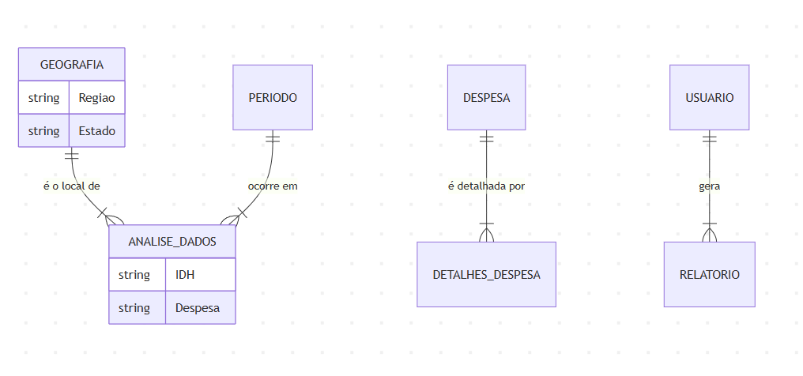
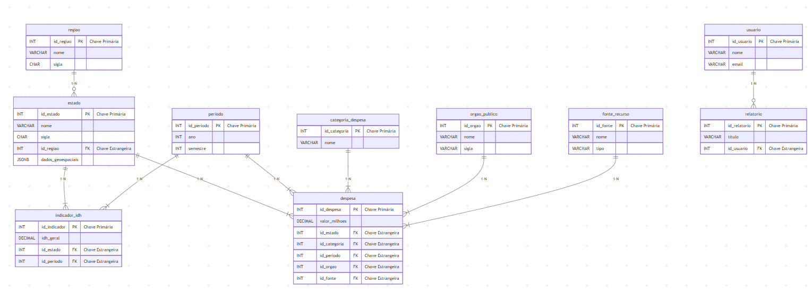

# UNIVERSIDADE FEDERAL DE SANTA CATARINA

# DEPARTAMENTO DE COMPUTAÇÃO

## CURSO DE BACHARELADO EM ENGENHARIA DE COMPUTAÇÃO

FELIPE FERREIRA DE SOUZA

# RELATÓRIO DO TRABALHO FINAL

## DISCIPLINA DE BANCO DE DADOS (DEC7588)

**Professor:** Alexandre L. Gonçalves

Araranguá, 2025

---

## SUMÁRIO

1. [DESCRIÇÃO DO OBJETIVO GERAL](#1-descrição-do-objetivo-geral-do-sistema)
2. [DESCRIÇÃO DETALHADA](#2-descrição-detalhada)
3. [MODELO CONCEITUAL](#3-modelo-conceitual)
4. [MODELO LÓGICO](#4-modelo-lógico)
5. [DDL (DATA DEFINITION LANGUAGE)](#5-ddl)
6. [CONSULTAS ANALÍTICAS](#6-consultas)
7. [APLICAÇÃO DESKTOP](#7-aplicação)

---

## 1. Descrição do objetivo geral do sistema:

Com a finalidade de analisar a correlação entre desenvolvimento humano e investimentos públicos nos estados brasileiros, este projeto desenvolve um sistema completo de análise de dados socioeconômicos. O software permite o controle e análise do Índice de Desenvolvimento Humano (IDH) em relação às despesas públicas federais no período de 2019-2023, oferecendo visualizações interativas, consultas analíticas avançadas e um chat com IA integrado para insights aprofundados.

## 2. Descrição detalhada:

Com a finalidade de prover as informações necessárias para o sistema, os seguintes requisitos foram levados em consideração:

1. **Gestão Geográfica e Socioeconômica:** O sistema permite o registro de estados e regiões, associando dados socioeconômicos e indicadores de desenvolvimento, incluindo dados geoespaciais.
2. **Controle de Despesas Públicas:** O software gerencia diferentes tipos de despesas públicas, categorizadas por área (Saúde, Educação, etc.) e órgão responsável, vinculando-as a um estado e período.
3. **Acompanhamento de Indicadores:** O sistema registra e acompanha o IDH e suas componentes (educação, saúde e renda) por estado e período.
4. **Cadastro de Entidades Públicas:** O sistema permite o registro de órgãos públicos responsáveis pelos investimentos, detalhando seu nome e escopo de atuação (federal, estadual).
5. **Gerenciamento de Fontes de Recurso:** O sistema mantém um registro detalhado das fontes de recurso financeiro, como Tesouro e Transferências.
6. **Controle de Acesso:** O sistema gerencia usuários com diferentes níveis de acesso (administradores ou analistas) com permissões específicas.
7. **Geração de Relatórios:** Para cada análise, o sistema gera relatórios que registram insights e recomendações, vinculados ao usuário que os criou.
8. **Integração com IA Generativa:** O sistema se integra ao Google Gemini para realizar análises avançadas de dados, gerando insights automáticos e recomendações personalizadas.

## 3. Modelo Conceitual:

O Modelo Conceitual abaixo ilustra as principais entidades do sistema e como elas se relacionam em um nível abstrato.



## 4. Modelo Lógico:

O Modelo Lógico detalha a estrutura do banco de dados, incluindo tabelas, colunas, chaves primárias (PK) e estrangeiras (FK).



## 5. DDL:

O script DDL (Data Definition Language) a seguir foi utilizado para criar a estrutura do banco de dados no PostgreSQL.

```sql
-- Criação do schema
CREATE SCHEMA IF NOT EXISTS dados_socioeconomicos;

-- Tabela de Regiões
CREATE TABLE dados_socioeconomicos.regiao (
    id_regiao SERIAL PRIMARY KEY,
    nome VARCHAR(50) NOT NULL,
    sigla CHAR(2) NOT NULL UNIQUE,
    created_at TIMESTAMP DEFAULT CURRENT_TIMESTAMP,
    updated_at TIMESTAMP DEFAULT CURRENT_TIMESTAMP
);

-- Tabela de Estados
CREATE TABLE dados_socioeconomicos.estado (
    id_estado SERIAL PRIMARY KEY,
    nome VARCHAR(50) NOT NULL,
    sigla CHAR(2) NOT NULL UNIQUE,
    id_regiao INTEGER NOT NULL,
    dados_geoespaciais JSONB,
    created_at TIMESTAMP DEFAULT CURRENT_TIMESTAMP,
    updated_at TIMESTAMP DEFAULT CURRENT_TIMESTAMP,
    FOREIGN KEY (id_regiao) REFERENCES dados_socioeconomicos.regiao(id_regiao)
);

-- Tabela de Períodos
CREATE TABLE dados_socioeconomicos.periodo (
    id_periodo SERIAL PRIMARY KEY,
    ano INTEGER NOT NULL,
    semestre INTEGER CHECK (semestre IN (1, 2)),
    descricao VARCHAR(100),
    created_at TIMESTAMP DEFAULT CURRENT_TIMESTAMP,
    UNIQUE (ano, semestre)
);

-- Tabela de Categorias de Despesa
CREATE TABLE dados_socioeconomicos.categoria_despesa (
    id_categoria SERIAL PRIMARY KEY,
    nome VARCHAR(100) NOT NULL,
    descricao TEXT,
    created_at TIMESTAMP DEFAULT CURRENT_TIMESTAMP,
    updated_at TIMESTAMP DEFAULT CURRENT_TIMESTAMP
);

-- Tabela de Órgãos Públicos
CREATE TABLE dados_socioeconomicos.orgao_publico (
    id_orgao SERIAL PRIMARY KEY,
    nome VARCHAR(100) NOT NULL,
    sigla VARCHAR(20),
    escopo VARCHAR(20) CHECK (escopo IN ('federal', 'estadual')),
    created_at TIMESTAMP DEFAULT CURRENT_TIMESTAMP,
    updated_at TIMESTAMP DEFAULT CURRENT_TIMESTAMP
);

-- Tabela de Fontes de Recurso
CREATE TABLE dados_socioeconomicos.fonte_recurso (
    id_fonte SERIAL PRIMARY KEY,
    nome VARCHAR(100) NOT NULL,
    tipo VARCHAR(50),
    descricao TEXT,
    created_at TIMESTAMP DEFAULT CURRENT_TIMESTAMP
);

-- Tabela de Despesas
CREATE TABLE dados_socioeconomicos.despesa (
    id_despesa SERIAL PRIMARY KEY,
    valor_milhoes DECIMAL(15,2) NOT NULL,
    id_estado INTEGER NOT NULL,
    id_categoria INTEGER NOT NULL,
    id_periodo INTEGER NOT NULL,
    id_orgao INTEGER NOT NULL,
    id_fonte INTEGER NOT NULL,
    created_at TIMESTAMP DEFAULT CURRENT_TIMESTAMP,
    FOREIGN KEY (id_estado) REFERENCES dados_socioeconomicos.estado(id_estado),
    FOREIGN KEY (id_categoria) REFERENCES dados_socioeconomicos.categoria_despesa(id_categoria),
    FOREIGN KEY (id_periodo) REFERENCES dados_socioeconomicos.periodo(id_periodo),
    FOREIGN KEY (id_orgao) REFERENCES dados_socioeconomicos.orgao_publico(id_orgao),
    FOREIGN KEY (id_fonte) REFERENCES dados_socioeconomicos.fonte_recurso(id_fonte)
);

-- Tabela de Indicadores IDH
CREATE TABLE dados_socioeconomicos.indicador_idh (
    id_indicador SERIAL PRIMARY KEY,
    id_estado INTEGER NOT NULL,
    id_periodo INTEGER NOT NULL,
    idh_geral DECIMAL(4,3) NOT NULL,
    idh_educacao DECIMAL(4,3),
    idh_saude DECIMAL(4,3),
    idh_renda DECIMAL(4,3),
    created_at TIMESTAMP DEFAULT CURRENT_TIMESTAMP,
    FOREIGN KEY (id_estado) REFERENCES dados_socioeconomicos.estado(id_estado),
    FOREIGN KEY (id_periodo) REFERENCES dados_socioeconomicos.periodo(id_periodo),
    CONSTRAINT chk_idh_range CHECK (
        idh_geral BETWEEN 0 AND 1 AND
        idh_educacao BETWEEN 0 AND 1 AND
        idh_saude BETWEEN 0 AND 1 AND
        idh_renda BETWEEN 0 AND 1
    )
);

-- Tabela de Usuários
CREATE TABLE dados_socioeconomicos.usuario (
    id_usuario SERIAL PRIMARY KEY,
    nome VARCHAR(100) NOT NULL,
    email VARCHAR(100) NOT NULL UNIQUE,
    senha_hash VARCHAR(64) NOT NULL,
    tipo VARCHAR(20) CHECK (tipo IN ('admin', 'analista')),
    created_at TIMESTAMP DEFAULT CURRENT_TIMESTAMP,
    updated_at TIMESTAMP DEFAULT CURRENT_TIMESTAMP
);

-- Tabela de Relatórios
CREATE TABLE dados_socioeconomicos.relatorio (
    id_relatorio SERIAL PRIMARY KEY,
    titulo VARCHAR(200) NOT NULL,
    conteudo TEXT NOT NULL,
    tipo_analise VARCHAR(50),
    id_usuario INTEGER NOT NULL,
    created_at TIMESTAMP DEFAULT CURRENT_TIMESTAMP,
    FOREIGN KEY (id_usuario) REFERENCES dados_socioeconomicos.usuario(id_usuario)
);

-- Índices para otimização
CREATE INDEX idx_despesa_estado_periodo ON dados_socioeconomicos.despesa(id_estado, id_periodo);
CREATE INDEX idx_idh_estado_periodo ON dados_socioeconomicos.indicador_idh(id_estado, id_periodo);
CREATE INDEX idx_estado_regiao ON dados_socioeconomicos.estado(id_regiao);
```

## 6. Consultas:

Foram implementadas três consultas analíticas principais, focadas na análise da relação entre IDH e investimentos públicos nos estados brasileiros.

### 6.1 - Consulta 01: Ranking IDH vs Investimento Público

**Descrição**: Análise comparativa entre desenvolvimento humano e investimentos públicos por estado.

**Script**:

```sql
SELECT 
    e.nome AS nome_estado,
    r.nome AS nome_regiao,
    AVG(i.idh_geral) AS idh_medio,
    SUM(d.valor_milhoes) AS total_investimento,
    SUM(CASE WHEN c.nome LIKE '%Saúde%' THEN d.valor_milhoes ELSE 0 END) AS inv_saude,
    (AVG(i.idh_geral) * 1000) / SUM(d.valor_milhoes) AS eficiencia
FROM estado e
JOIN regiao r ON e.id_regiao = r.id_regiao
JOIN indicador_idh i ON e.id_estado = i.id_estado
JOIN despesa d ON e.id_estado = d.id_estado
JOIN categoria_despesa c ON d.id_categoria = c.id_categoria
JOIN periodo p ON i.id_periodo = p.id_periodo AND d.id_periodo = p.id_periodo
WHERE p.ano = 2023
GROUP BY e.id_estado, e.nome, r.nome
ORDER BY AVG(i.idh_geral) DESC;
```

**Resultado da Consulta:**

[COLE A TABELA DE RESULTADOS DA CONSULTA 1 AQUI]

**Gráfico Gerado:**

[COLE A IMAGEM DO GRÁFICO DA CONSULTA 1 AQUI]

### 6.2 - Consulta 02: Evolução Temporal de Indicadores

**Descrição**: Análise histórica de IDH e investimentos com identificação de tendências.

**Script**:

```sql
SELECT 
    p.ano,
    AVG(i.idh_geral) AS idh_medio_ano,
    SUM(d.valor_milhoes) AS investimento_total_ano,
    COUNT(d.id_despesa) AS total_despesas,
    COUNT(DISTINCT d.id_orgao) AS orgaos_ativos
FROM periodo p
JOIN indicador_idh i ON p.id_periodo = i.id_periodo
JOIN despesa d ON p.id_periodo = d.id_periodo
GROUP BY p.ano
ORDER BY p.ano;
```

**Resultado da Consulta:**

[COLE A TABELA DE RESULTADOS DA CONSULTA 2 AQUI]

**Gráfico Gerado:**

[COLE A IMAGEM DO GRÁFICO DA CONSULTA 2 AQUI]

### 6.3 - Consulta 03: Análise Comparativa Regional

**Descrição**: Comparação detalhada entre as 5 regiões brasileiras.

**Script**:

```sql
SELECT 
    r.nome AS nome_regiao,
    COUNT(DISTINCT e.id_estado) AS total_estados,
    AVG(i.idh_geral) AS idh_regional_medio,
    STDDEV(i.idh_geral) AS idh_desvio_padrao,
    SUM(d.valor_milhoes) AS investimento_regional_total,
    SUM(CASE WHEN c.nome LIKE '%Saúde%' THEN d.valor_milhoes ELSE 0 END) AS inv_saude_regional
FROM regiao r
JOIN estado e ON r.id_regiao = e.id_regiao
JOIN indicador_idh i ON e.id_estado = i.id_estado
JOIN despesa d ON e.id_estado = d.id_estado
JOIN categoria_despesa c ON d.id_categoria = c.id_categoria
GROUP BY r.id_regiao, r.nome
ORDER BY AVG(i.idh_geral) DESC;
```

**Resultado da Consulta:**

[COLE A TABELA DE RESULTADOS DA CONSULTA 3 AQUI]

**Gráfico Gerado:**

[COLE A IMAGEM DO GRÁFICO DA CONSULTA 3 AQUI]

## 7. Aplicação:

O sistema foi desenvolvido como uma aplicação desktop moderna usando Python e um conjunto de bibliotecas robustas para garantir uma experiência de usuário fluida e funcionalidades analíticas poderosas.

1. **Tecnologias Utilizadas**:

   * **Interface Gráfica**: Tkinter com o tema `ttkbootstrap` para uma UI moderna e responsiva. Matplotlib e Plotly foram integrados para a geração de gráficos interativos.
   * **Backend e Banco de Dados**: SQLAlchemy foi utilizado como ORM para mapear os objetos Python ao banco de dados PostgreSQL, simplificando as operações de persistência. A manipulação e análise de dados foram feitas com a biblioteca Pandas.
   * **Inteligência Artificial**: O modelo de linguagem `Google Gemini` foi integrado para prover uma interface de chat capaz de realizar análises sobre os dados.
2. **Funcionalidades Principais**:

   * **Dashboard Executivo**: Tela inicial com os principais KPIs e visualizações.
   * **Gerenciamento de Dados (CRUD)**: Interface completa para criar, ler, atualizar e deletar registros em todas as tabelas do sistema.
   * **Visualizações Interativas**: Geração de gráficos e tabelas para as consultas analíticas, permitindo a exploração dos dados.
   * **Chat com IA**: Um assistente virtual para análise de dados e geração de insights.
   * **Setup do Banco de Dados**: A aplicação possui rotinas para, a partir de um banco de dados vazio, criar todo o schema (`schema.sql`), popular as tabelas com dados iniciais (`seed_data.py`) e também uma função para apagar todas as tabelas, facilitando o reset do ambiente.
3. **Estrutura do Projeto**:

   ```
   Projeto Final/
   ├── main.py                 # Ponto de entrada da aplicação
   ├── requirements.txt        # Dependências do projeto
   ├── src/                    # Código fonte
   │   ├── database/           # Conexão, schema e seed
   │   ├── models/             # Modelos de dados (ORM)
   │   ├── crud/               # Lógica das operações CRUD
   │   ├── queries/            # Consultas analíticas
   │   ├── visualization/      # Geração de gráficos
   │   ├── llm/                # Integração com IA
   │   └── gui/                # Componentes da interface
   └── data/                   # Arquivos de dados
   ```
4. **Telas da Aplicação**:

[COLE A IMAGEM DA TELA PRINCIPAL AQUI]

[COLE A IMAGEM DA TELA DE GERENCIAMENTO DE DADOS (CRUD) AQUI]

[COLE A IMAGEM DA TELA DO CHAT COM IA AQUI]

```

```
